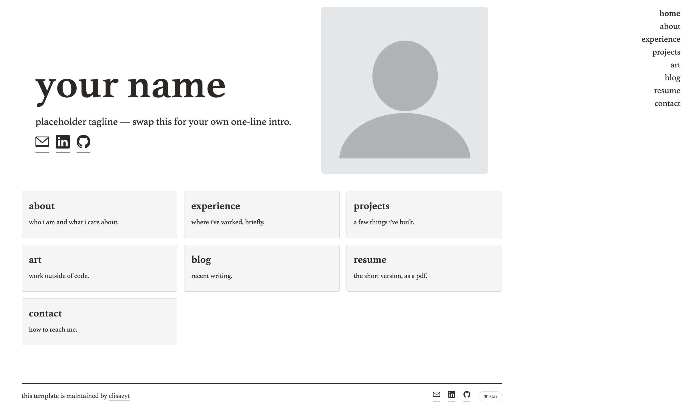

# Personal Site Template

A minimalist template for a personal site based on Jekyll and GitHub Pages.

Cloned from the [athena template by broccolini](https://github.com/broccolini/athena), design choices inspired by [Omkar Pathak's personal site](https://github.com/OmkarPathak/omkarpathak.github.io).
> Note: Significant modifications were made with AI assistance.



## Setup
1. [Install Ruby](https://www.ruby-lang.org/en/documentation/installation/) or [set up rbenv](https://github.com/rbenv/rbenv#readme)

2. Install Jekyll and Bundler:
   ```bash
   gem install jekyll bundler
   ```

3. Clone your fork of this repo (replace the URL below with your own fork's, not the original):
   ```bash
   git clone https://github.com/<your-username>/<your-repo-name>.git
   ```

4. Navigate to repo folder:
   ```bash
   cd <your-repo-name>
   ```

5. Install dependencies (defined in Gemfile, may require modification if version incompatibilities arise):
   ```bash
   bundle install
   ```

6. **IMPORTANT:** in `_config.yml`, set `url`, `baseurl`, `github_repo`, and `github_username` to match your own GitHub Pages deployment:
   ```yaml
   url: "https://<your-username>.github.io" # the domain GitHub Pages will serve your site at
   baseurl: "/<your-repo-name>" # leave this blank if this is your user site
   github_repo: <your-repo-name>
   github_username: <your-username>
   ```

7. Run the website locally:
   ```bash
   bundle exec jekyll serve
   ```

## Useful websites
A non-comprehensive list of resources for learning the basics of Jekyll and GitHub Pages:
- Jekyll docs: https://jekyllrb.com/docs/
- GitHub Pages docs: https://docs.github.com/en/pages
- Blog: https://andlukyane.com/blog/how-i-created-this-website
- Youtube tutorial: https://www.youtube.com/watch?v=fV01b0duZwU


## License
This template is available under the terms of the [MIT License](http://opensource.org/licenses/MIT). Feel free to clone (recommended) or fork.